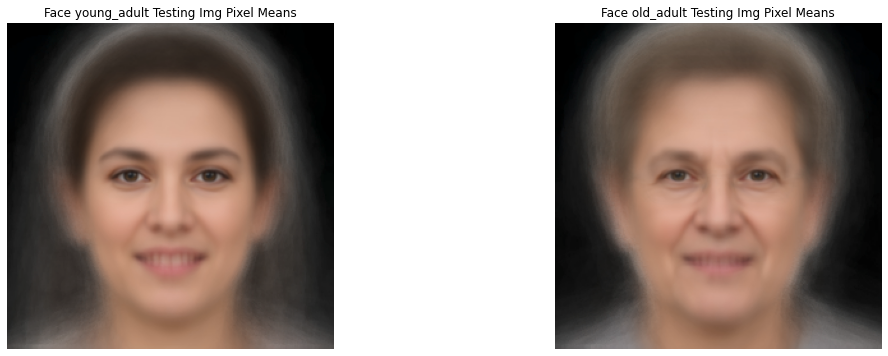
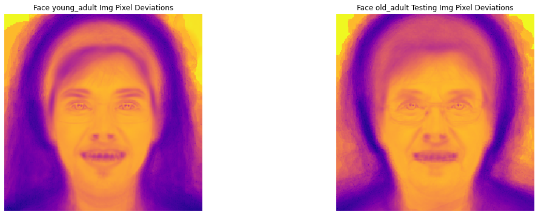

# 🧠 machine-learning-face-classifier
Generative Machine Learning model based on Bayes's rule to classify human faces.

A generative machine learning model based on **Bayes' rule** to classify human faces into age groups. This project computes statistical models (mean and variance) for each class and uses probabilistic reasoning to predict the most likely age group of a new face.


*Mean faces for each age group: young adult, adult, and old.*


*Pixel-wise standard deviations showing variation within each group.*

---

## 🎯 Project Goal

Classify face images into one of three age categories:
- `young_adult`
- `adult`
- `old`

Using a **Bayesian classifier**, this model learns the "typical" face and variation pattern for each group, then predicts new images based on likelihood.

---

## 🛠️ How It Works

1. **Training Phase**:
   - Compute the **mean face** and **standard deviation face** for each class.
   - These represent the "average" appearance and variability.

2. **Classification**:
   - For a new face, compute how well it matches each class using **Bayes’ rule**.
   - Assign the class with the highest probability.

3. **Features Used**:
   - Raw pixel intensities in LAB color space (better for lighting invariance).

---

## 📁 Dataset Structure

The dataset is organized into training and testing folders:

training-young-adult/
training-adult/
training-old/
testing-young-adult/
testing-adult/
testing-old/


Each folder contains `.png` images named like `img-001.png`, `img-002.png`, etc.

> 💡 Note: This project uses a small, custom dataset. For better results, consider expanding with public datasets like [UTKFace](https://github.com/dchen236/FairFace).

---

## ⚙️ Setup & How to Run

### 1. Clone the Repository
```bash
git clone https://github.com/janarosmonaliev/machine-learning-face-classifier.git
cd machine-learning-face-classifier
